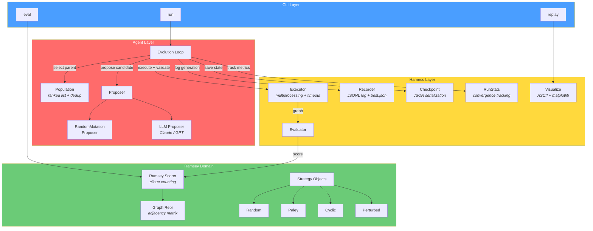
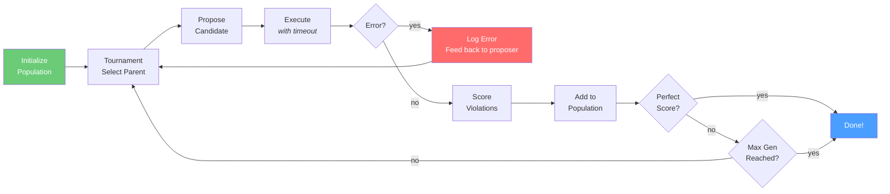

# EvolveClaw-Ramsey


A minimal, educational implementation of AlphaEvolve-style evolutionary search applied to Ramsey number lower bounds.

## Overview

**EvolveClaw-Ramsey** is a single-process Python system that uses evolutionary strategies to search for Ramsey-number counter-example colorings. It draws direct inspiration from Google DeepMind's [AlphaEvolve](https://arxiv.org/abs/2506.13131) paper (2025), which demonstrated that evolving *programs* (search heuristics) rather than raw solutions can push the boundaries of combinatorial mathematics.

The name combines **Evolve** (the evolutionary search core from AlphaEvolve) with **Claw** (a nod to the OpenClaw agent ecosystem), reflecting the project's dual heritage: AlphaEvolve's evolutionary methodology and modern AI-agent design patterns.

This project is deliberately small and transparent. It is designed for learning, not for breaking records.

**This is not a benchmark or record-setting system.** It is an educational implementation meant to make the AlphaEvolve-style workflow understandable and easy to inspect.

## Who This Is For

- Readers who want a small, inspectable AlphaEvolve-style system they can actually understand end-to-end.
- Experimenters who want to compare random mutation against an optional real LLM proposer.
- Developers who care more about clear structure and reproducible runs than benchmark-chasing.

This repository is not a production search stack. It is a compact educational implementation with enough instrumentation to inspect whether a run really used the LLM path.

## Architecture



### Evolution Flow



## Core Ideas

### AlphaEvolve's Insight

AlphaEvolve showed that LLMs can act as mutation operators in an evolutionary loop: propose code changes, evaluate them automatically, and keep the best. The key is evolving the *search algorithm itself*, not individual candidate solutions. Applied to Ramsey theory, this approach improved lower bounds on several Ramsey numbers (arXiv:2603.09172).

### Our Minimal Implementation

EvolveClaw-Ramsey distills this into its simplest useful form:

- **Strategy objects** replace AlphaEvolve's evolved programs. Each strategy is a callable that decides how to color edges of a complete graph K_n.
- **Mutation operators** (random parameter perturbation, strategy type switching, edge flipping via PerturbedStrategy) stand in for LLM-proposed code diffs.
- **A synchronous evolution loop** replaces AlphaEvolve's async pipeline with a straightforward generate-evaluate-select cycle.
- **Violation-counting scorer** provides the fitness signal: fewer monochromatic s-cliques and t-cliques means a better coloring.

### Design Pattern Influences

Several open-source AI agent projects informed the engineering approach:

- **OpenClaw** -- personal AI assistant with gateway architecture and multi-platform skill system; its modular package design influenced the clean separation between `ramsey/`, `agent/`, and `harness/` packages.
- **OpenCode** -- open-source terminal coding agent with provider-agnostic design; its `LLMProvider` abstraction pattern is adopted in our `LLMProvider` ABC, making it trivial to add new LLM backends. Its executor patterns also informed the executor/evaluator split in the harness layer.
- **OpenEvolve** -- faithful AlphaEvolve reimplementation; its error artifact side-channel pattern (feeding execution failures back into prompts) is adopted in our proposer's `last_error` feedback mechanism.
- **nanobot** -- ultra-lightweight OpenClaw delivering core agent functionality in ~4000 lines of code; validated the philosophy of keeping this project small and readable.
- **A3S-Code** -- listed as a reference per project requirements.

### Harness Engineering

The harness layer (`evolveclaw_ramsey/harness/`) wraps the core search with operational concerns:

- **Executor** -- runs strategy objects in isolated subprocesses with timeouts and error isolation.
- **Evaluator** -- scores candidates and ranks them.
- **Recorder** -- logs generation-by-generation results (JSONL format) and tracks the best coloring found.
- **Checkpoint** -- saves and restores population state + RNG state for resumable runs.
- **Stats** -- tracks convergence metrics (best/mean score, strategy type diversity) per generation.
- **Visualize** -- renders ASCII score curves in the terminal and optional matplotlib plots.

## References and Inspirations

| Project | What We Borrowed |
|---------|-----------------|
| [AlphaEvolve](https://arxiv.org/abs/2506.13131) | Core idea: evolutionary loop with LLM-as-mutator for combinatorial search |
| [OpenEvolve](https://github.com/algorithmicsuperintelligence/openevolve) | Population management, checkpoint design, error artifact feedback pattern; validated our simplifications |
| [google-research/ramsey](https://github.com/google-research/google-research/tree/master/ramsey_number_bounds) | Ramsey-specific evaluation and benchmark data |
| [OpenClaw](https://github.com/openclaw/openclaw) | Gateway/dispatcher architecture; inspired modular `ramsey/`, `agent/`, `harness/` package separation |
| [OpenCode](https://github.com/anomalyco/opencode) | Provider-agnostic LLM abstraction (`LLMProvider` ABC); informed executor/evaluator split and CLI patterns |
| [nanobot](https://github.com/HKUDS/nanobot) | Ultra-minimal agent philosophy (~4000 lines); validated "minimal yet functional" educational approach |
| [A3S-Code](https://github.com/A3S-Lab/Code) | Listed per project requirements |

## Project Boundaries

### Educational Simplifications

| AlphaEvolve (Production) | EvolveClaw-Ramsey (Educational) |
|--------------------------|-------------------------------|
| MAP-Elites + island model | Simple ranked population list |
| LLM ensemble (Flash + Pro) | Single optional LLM proposer |
| Asynchronous pipeline | Synchronous loop |
| Diff-based code mutations | Strategy object mutations |
| Distributed evaluation | Multiprocessing with timeout |
| Production infrastructure | Educational single-file runs |

### What Is NOT Included

- No distributed computation or multi-node support.
- No production-grade LLM integration (the optional LLM proposer is a proof-of-concept).
- No MAP-Elites or island-based diversity maintenance.
- No claim of reproducing AlphaEvolve's Ramsey results. The known Ramsey bounds require far more compute and sophistication than this project provides.
- No GPU acceleration. All graph operations use NumPy on CPU.

### Honest Limitations

This project will not discover new Ramsey number bounds. It is a teaching tool that demonstrates the *shape* of AlphaEvolve's approach in a form that fits in a single Python package. The evolutionary loop works, the scoring is correct, but the search space for meaningful Ramsey problems is vast and the mutations here are simple.

## Quick Start

### Install

```bash
# Install core + dev dependencies (pytest, etc.)
pip install -e ".[dev]"

# Install core + dev + real LLM provider SDKs
pip install -e ".[dev,llm]"
```

Or using requirements.txt:

```bash
pip install -r requirements.txt
```

`requirements.txt` installs the core runtime and test dependencies, but not the optional LLM SDKs. For real Anthropic/OpenAI runs, use the `llm` extra:

```bash
pip install -e ".[llm]"
```

Use the shortest path that matches what you want to do:

- `pip install -r requirements.txt` or `pip install -e ".[dev]"` if you only want the random-mutation path and local tests.
- `pip install -e ".[llm]"` or `pip install -e ".[dev,llm]"` if you want real Anthropic/OpenAI calls.

Set your API key for the provider you want to use:

```bash
# Linux / macOS (bash/zsh):
export ANTHROPIC_API_KEY=your-key-here   # For Anthropic (default)
export OPENAI_API_KEY=your-key-here      # For OpenAI

# Windows (PowerShell):
$env:ANTHROPIC_API_KEY='your-key-here'
$env:OPENAI_API_KEY='your-key-here'
```

Without the LLM extra, configuring `type: llm` will fail at startup with a clear error message.

### Run Tests

```bash
python -m pytest -q
```

### Run the Demo

Quick path:

1. Install dependencies.
2. Run either the random demo or the LLM demo.
3. Inspect the run artifacts to confirm whether the LLM path was actually used.

```bash
# Random mutation proposer (no LLM needed)
python -m evolveclaw_ramsey.cli run --config configs/demo.yaml

# LLM proposer (requires .[llm] install and API key)
python -m evolveclaw_ramsey.cli run --config configs/llm_demo.yaml
```

To switch the LLM demo from Anthropic to OpenAI, edit `configs/llm_demo.yaml`:

```yaml
proposer:
  type: llm
  llm_provider: openai
  llm_model: gpt-4.1-mini
  llm_api_key_env: OPENAI_API_KEY
```

Or use the shell script on bash-compatible shells:

```bash
bash scripts/run_demo.sh
```

On Windows PowerShell, prefer the explicit `python -m evolveclaw_ramsey.cli run ...` commands above.

After the run finishes, replay it to inspect the output directory and score history:

```bash
python -m evolveclaw_ramsey.cli replay <run_dir>
```

### View Results

Results are written to the `runs/` directory. Each run produces:

| Artifact | Purpose |
|----------|---------|
| `log.jsonl` | Generation-by-generation progress log. Successful and failed records include `proposer_source` (`"random"`, `"llm"`, or `"llm_fallback"`). |
| `checkpoints/` | Population and RNG snapshots for resume/recovery. |
| `best.json` | Best candidate found so far, including its score, violation count, and `proposer_source`. |
| `summary.txt` | Human-readable run summary. LLM runs include total calls, parsed count, and failure count. |
| `config.yaml` | Snapshot of the config used for the run. |

If you want to verify that a run genuinely exercised the LLM path, inspect these fields:

- `log.jsonl`: per-generation `proposer_source`
- `best.json`: provenance of the current best candidate
- `summary.txt`: aggregate LLM call counts

Example `log.jsonl` record:

```json
{"generation": 12, "score": 8.0, "strategy_name": "cyclic", "proposer_source": "llm"}
```

Example failed record showing fallback provenance:

```json
{"generation": 13, "error": "Timeout", "proposer_source": "llm_fallback"}
```

Example `best.json` snippet:

```json
{"generation": 12, "score": 8.0, "violation_count": 9, "proposer_source": "llm"}
```

### Replay & Visualize

```bash
# ASCII score curve in the terminal
python -m evolveclaw_ramsey.cli replay <run_dir>

# With matplotlib plot saved as PNG
python -m evolveclaw_ramsey.cli replay <run_dir> --plot
```

## Repository Structure

```
evolveclaw_ramsey/
  __init__.py
  __main__.py
  cli.py                    # CLI entry point (run / eval / replay)
  ramsey/                   # Domain layer: Ramsey graph theory
    graph_repr.py            # Adjacency matrix utilities (validate, complement, edge list)
    scoring.py               # Monochromatic clique violation counter
    strategies.py            # Graph construction strategies (Random, Paley, Cyclic, Perturbed)
  agent/                    # Agent layer: evolutionary search logic
    population.py            # Ranked population with deduplication and tournament selection
    proposer.py              # Strategy proposers (RandomMutation, LLM with Anthropic/OpenAI)
    loop.py                  # Main evolution loop with checkpoint/resume
  harness/                  # Harness layer: operational infrastructure
    executor.py              # Subprocess execution with timeout and validation
    evaluator.py             # Strategy evaluation pipeline
    recorder.py              # JSONL logging, best.json tracking, summary generation
    checkpoint.py            # Population + RNG state serialization
    stats.py                 # Per-generation convergence statistics
    visualize.py             # ASCII score plots and matplotlib visualization
  utils/                    # Shared utilities
    config.py                # YAML config loading with deep-merge defaults
    logging.py               # Logging setup (console + file)
configs/
  demo.yaml                  # Quick demo: R(4,4) with n=17, 100 generations
  llm_demo.yaml              # LLM proposer configuration
scripts/
  run_demo.sh                # Quick demo launcher
  run_search.sh              # Full search launcher
research/
  notes.md                   # Research notes on AlphaEvolve and Ramsey theory
  sources.md                 # Reference links and bibliography
  tests/                      # pytest suite covering core behavior and edge cases
  test_graph_repr.py          test_population.py
  test_scoring.py             test_proposer.py
  test_strategies.py          test_recorder.py
  test_evaluator.py           test_stats.py
  test_executor.py            test_checkpoint.py
  test_loop.py                test_config.py
  test_cli.py                 test_logging.py
  test_visualize.py
```

## Technical Details

### Candidate Representation

Each candidate is a **strategy object** that produces a 2-coloring of the edges of the complete graph K_n. The coloring is stored as an n-by-n symmetric adjacency matrix with values in {0, 1}, where 0 and 1 represent the two colors (conventionally "red" and "blue").

Four built-in strategy types:

| Strategy | Description | Parameters |
|----------|-------------|------------|
| **Random** | Bernoulli random edges | `edge_prob` (0-1) |
| **Paley** | Quadratic residue construction for primes p = 1 mod 4 | None (deterministic from n) |
| **Cyclic** | Connect vertices at specified cyclic offsets | `offsets` (list of ints) |
| **Perturbed** | Flip random edges of a base strategy's output | `base` (any strategy), `flip_prob` |

### Scoring Logic

The scorer counts **monochromatic cliques**: for a target R(s, t), it counts the number of monochromatic s-cliques in color 0 and t-cliques in color 1. A coloring with zero violations is a valid counter-example proving R(s, t) > n.

The fitness function is:

```
score = n - violations * penalty_weight
```

where `violations = count_cliques(G, s) + count_cliques(complement(G), t)`. Higher scores are better; a perfect score of `n` (the graph size) means zero violations and a valid Ramsey counter-example was found.

### Evolution Loop

1. **Initialize** a population of strategy objects (random, Paley, cyclic varieties).
2. **Execute** each candidate in an isolated subprocess with timeout.
3. **Score** the resulting coloring by counting monochromatic clique violations.
4. **Select** parents via tournament selection (pick `k` candidates, take the best).
5. **Mutate** selected parents to produce offspring (parameter perturbation, strategy type switching, or edge flipping).
6. **Replace** the worst members of the population with better offspring (with deduplication).
7. **Repeat** for `max_generations` or until a zero-violation coloring is found.

Failed candidates feed their error messages back into the proposer via the `last_error` mechanism, guiding the search away from failing strategies.

### Harness Layers

The harness wraps the core loop with operational infrastructure:

- **Executor** runs each strategy in a child process with a configurable timeout, catching crashes and infinite loops.
- **Evaluator** takes executor output and computes fitness scores.
- **Recorder** writes per-generation statistics in JSONL format and maintains `best.json` with the highest-scoring coloring.
- **Checkpoint** serializes population state and RNG state to disk at configurable intervals for crash recovery and deterministic resume.
- **Stats** tracks convergence metrics per generation: best score, mean score, strategy type diversity, improvement count.
- **Visualize** renders ASCII score evolution curves in the terminal, with optional matplotlib PNG export.

## Configuration

Configuration is via YAML files. See `configs/demo.yaml` for the default:

```yaml
problem:
  s: 4              # First Ramsey parameter
  t: 4              # Second Ramsey parameter
  n: 17             # Graph size (searching for R(s,t) > n)
  penalty_weight: 1.0

evolution:
  max_generations: 100
  population_size: 20
  tournament_k: 3
  checkpoint_interval: 10

proposer:
  type: random       # or "llm" with llm_demo.yaml

executor:
  timeout_seconds: 10

logging:
  level: INFO

seed: 42
run_dir: runs/
```

Key parameters:
- `s`, `t`: The Ramsey parameters. R(4,4) = 18, so n=17 should have valid counter-examples.
- `n`: The graph size. We are looking for a 2-coloring of K_n with no monochromatic s-clique or t-clique.
- `population_size`: Number of candidates maintained each generation.
- `tournament_k`: Number of candidates sampled for tournament selection.
- `checkpoint_interval`: Save population state every N generations.

## Future Extensions

- **MAP-Elites Population** -- Replace the ranked list with a MAP-Elites grid for better diversity maintenance.
- **Benchmark Suite** -- Systematic evaluation across R(3,k) and R(4,k) for various n values.
- **Island Model** -- Multiple sub-populations with periodic migration to reduce premature convergence.
- **Graph Coloring Visualization** -- Visual rendering of edge colorings for found counter-examples.

## License

This project is for educational and research purposes.
